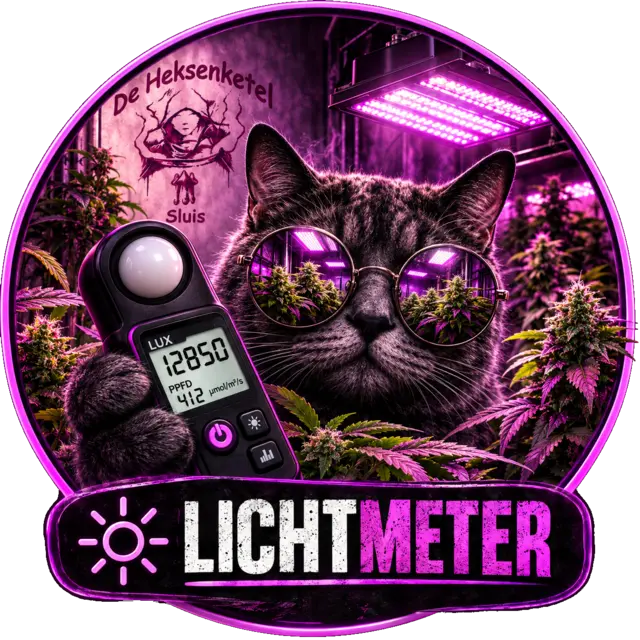
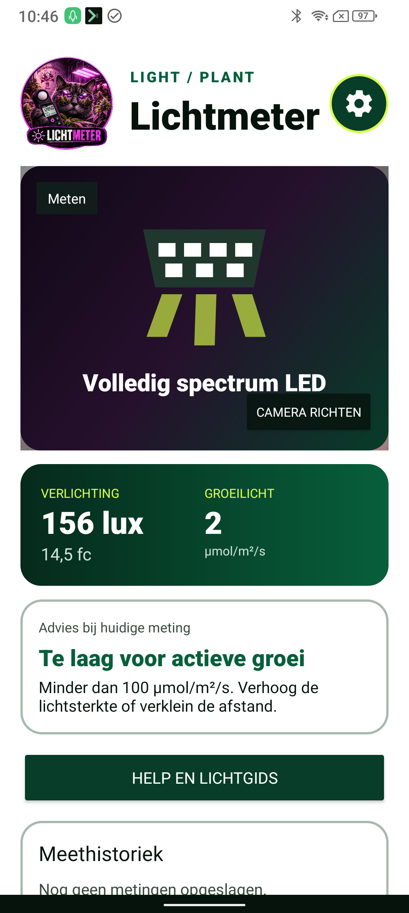
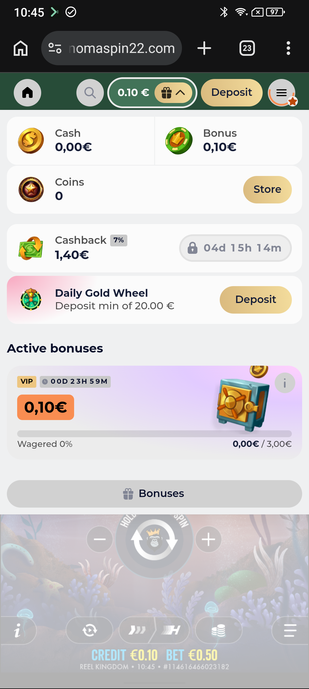
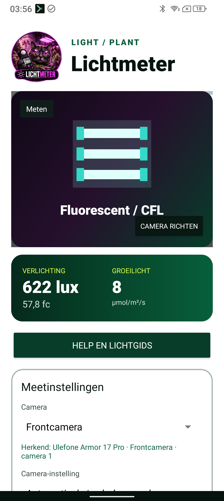
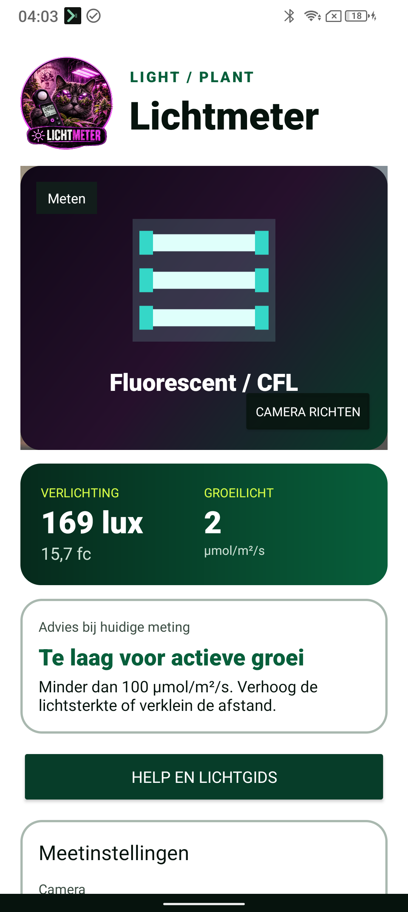
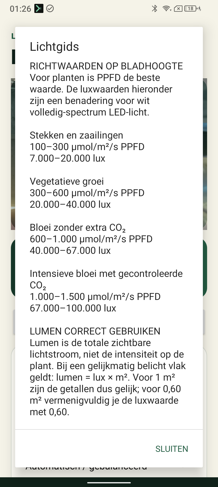

<p align="center">
  
</p>

<h1 align="center">Licht-Meter</h1>

<p align="center">
  Camera-gebaseerde Android-lichtmeter voor lux, foot-candles, lumen en geschatte PPFD.
</p>

<p align="center">
  
  
  
  
</p>

## Over de app

Licht-Meter gebruikt Camera2-belichtingsgegevens en het centrale deel van het camerabeeld
om lichtsterkte indicatief te meten. De app is gericht op plantenverlichting en combineert
de actuele meetwaarde met automatische lampherkenning, PPFD-schatting, groeifaseadvies en
een lokale meethistoriek.

De app begint standaard met de frontcamera. Via het draaiende tandwiel worden alle
instellingen in een compact popupscherm geopend, zodat het hoofdscherm overzichtelijk
blijft en buiten in zonlicht goed leesbaar is.

## Screenshots

<table>
  <tr>
    <td align="center"><strong>Hoofdscherm</strong></td>
    <td align="center"><strong>Instellingenpopup</strong></td>
    <td align="center"><strong>TL-herkenning</strong></td>
  </tr>
  <tr>
    <td></td>
    <td></td>
    <td></td>
  </tr>
</table>

<table>
  <tr>
    <td align="center"><strong>Groeifaseadvies</strong></td>
    <td align="center"><strong>Help en lichtgids</strong></td>
  </tr>
  <tr>
    <td></td>
    <td></td>
  </tr>
</table>

## Functies

- Live lichtsterkte in `lux` en `foot-candles` (`1 fc = 10,7639 lux`).
- Geschatte PPFD in `µmol/m²/s`, aangepast aan het gekozen of herkende lampspectrum.
- Lumenberekening als `lux × belicht oppervlak in m²`.
- Frontcamera als standaard, met keuze voor de achtercamera.
- Automatische herkenning van wit/full-spectrum LED, paars/blurple LED, HPS en TL/CFL.
- Herkenning via kleurverhoudingen, helderheidsflikkering en gemeten lichtsterkte.
- Automatische Camera2-witbalans en PPFD-factor per herkende bron.
- Illustratie van het herkende lamptype; livebeeld beschikbaar via `Camera richten`.
- Presets voor automatisch, felle groeilamp en weinig licht.
- Afzonderlijke kalibratiefactor en preset per fysieke camera.
- Direct groeifaseadvies voor stekken, zaailingen, groei en bloei.
- Waarschuwingen bij te weinig of mogelijk te veel licht.
- Lokale opslag met datum, tijd, lampnaam, camera, lux, fc, PPFD en optioneel lumen.
- Historiek van maximaal 100 recente metingen om lampen over meerdere dagen te volgen.
- Ingebouwde Help met meetinstructies, groeibereiken en typische LED-uitvoer.
- Volledige interface in Nederlands, Engels, Frans en Duits.
- Portretstand, hoogcontrastthema en maximale schermhelderheid tijdens gebruik.
- Instellingen in één popup via een continu subtiel draaiend tandwiel.

## PPFD-richtwaarden

| Fase | PPFD | Lux bij witte full-spectrum LED | Foot-candles |
|---|---:|---:|---:|
| Stekken en zaailingen | 100-300 µmol/m²/s | 7.000-20.000 lux | 650-1.860 fc |
| Vegetatieve groei | 300-600 µmol/m²/s | 20.000-40.000 lux | 1.860-3.720 fc |
| Bloei zonder extra CO₂ | 600-1.000 µmol/m²/s | 40.000-67.000 lux | 3.720-6.225 fc |
| Intensieve bloei met CO₂ | 1.000-1.500 µmol/m²/s | 67.000-100.000 lux | 6.225-9.290 fc |

Deze bereiken zijn algemene richtwaarden. Plantensoort, cultivar, temperatuur, voeding,
fotoperiode en CO₂-niveau beïnvloeden de optimale lichtsterkte.

## Meten

1. Open het tandwiel en controleer camera, preset en lichtbron.
2. Kies `Automatisch herkennen` of selecteer het lamptype handmatig.
3. Druk op `Camera richten` en richt de meetcirkel vanaf bladhoogte naar de lamp.
4. Houd de telefoon stil totdat bron en meetwaarden stabiliseren.
5. Keer terug naar de bronillustratie en lees lux, fc, PPFD en groeifaseadvies af.
6. Vul voor lumen het gelijkmatig belichte oppervlak in vierkante meter in.
7. Geef de lamp of locatie een naam en sla de meting op.

## Kalibreren

Telefooncamera's verschillen sterk. Kalibratie per camera verbetert de herhaalbaarheid:

1. Plaats telefoon en referentiemeter op dezelfde hoogte en positie.
2. Gebruik dezelfde lamp, dimstand en afstand als bij latere metingen.
3. Wacht tot beide waarden stabiel zijn.
4. Bereken `referentiewaarde in lux / getoonde lux`.
5. Vul de uitkomst in als kalibratiefactor, bijvoorbeeld `1,18`.

De factor wordt afzonderlijk bewaard voor iedere fysieke camera.

## Belangrijke beperking

Een telefooncamera is geen gekalibreerde luxmeter of PAR/quantumsensor. De app meet geen
fotonen rechtstreeks. Camera-exposure, automatische witbalans, filters en lampspectrum
verschillen per toestel. Lux, lumen en PPFD zijn daarom **indicatieve schattingen**.

Ook automatische lampherkenning is heuristisch. Vooral zonlicht en wit LED-licht kunnen
via een telefoonbeeld moeilijk betrouwbaar van elkaar worden onderscheiden. Gebruik voor
professionele teeltbeslissingen een gekalibreerde quantum- of PAR-meter.

## Privacy

- Camerabeelden worden lokaal en alleen tijdens de meting verwerkt.
- De app uploadt geen beelden of metingen.
- De meethistoriek staat uitsluitend in een lokale SQLite-database.
- Er is geen account, tracking- of internetpermissie nodig.

## Techniek

- Native Android-app in Java 17.
- Camera2 met `YUV_420_888`-beeldanalyse.
- ISO, sluitertijd, diafragma en centrale beeldluminantie voor de luxschatting.
- YUV-kleurkanalen en tijdelijke luminantievariatie voor bronclassificatie.
- SQLite voor lokale meethistoriek.
- Android resource-localisatie voor `nl`, `en`, `fr` en `de`.
- Geen externe runtimebibliotheken.

## Projectstructuur

```text
app/src/main/java/com/growshopsluis/lightmeter/
├── MainActivity.java          Camera, interface en live analyse
├── LightCalculations.java     Lux-, fc-, lumen- en PPFD-berekeningen
├── LampClassifier.java        Heuristische lichtbronclassificatie
└── MeasurementStore.java      Lokale SQLite-meethistoriek

app/src/main/res/
├── layout/                    Hoofdscherm en instellingenpopup
├── drawable/                  Logo, lichtbronillustraties en UI-vormen
└── values*/                   NL, EN, FR en DE teksten
```

## Bouwen

Vereisten:

- JDK 17
- Android SDK 34
- Android 8.0 / API 26 of nieuwer voor het toestel

```bash
./gradlew test assembleDebug lintDebug
```

De debug-APK verschijnt in:

```text
app/build/outputs/apk/debug/app-debug.apk
```

## Tests

De unit-tests controleren onder andere:

- exposure-naar-luxberekening;
- lux-naar-foot-candleconversie;
- lumen- en PPFD-conversies;
- herkenning van paars LED, HPS, TL/CFL en stabiel wit LED-licht.

Voer alles uit met:

```bash
./gradlew clean test assembleDebug lintDebug
```
